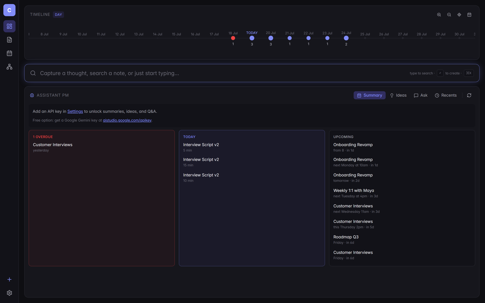

<div align="center">

# Cortex

A second brain for product managers — captures the day in plain markdown, watches commitments surface on a timeline, and lets an LLM find the ideas you left on the table.

**[→ Open the app](https://cortex-psi.vercel.app)** &nbsp;·&nbsp; **[→ Landing page](https://samban1.github.io/Cortex/)** &nbsp;·&nbsp; **[→ Portfolio](https://www.sambitxsamba.com)**



</div>

---

## What it is

Cortex is a note-taking app built around the way a working PM actually captures information: fast, dated, connected, and searchable by shape as well as text.

- **Every note is dated.** No more "which day did I write this?"
- **Every commitment in prose gets parsed.** Write *"review with Maya next Tuesday at 4pm"* and it lands on a timeline and calendar automatically.
- **Every wikilink and tag becomes a graph edge.** See how your work actually clusters.
- **An LLM sits on top**, grounded in your own notes — it summarises, surfaces ideas, and answers questions across the vault.

## Features

- **Quick capture** — global capture bar on the dashboard; type, hit Enter, keep moving.
- **Markdown editor** (CodeMirror 6) with live preview, code blocks, `[[wikilinks]]`, `#tags`, task lists.
- **Natural-language date extraction** (chrono-node) — dates in prose show up as chips on the note and dots on the timeline.
- **Multi-level timeline** — day, week, month, quarter, year; smooth crossfade between zoom levels.
- **Month calendar** with commitment dots and a today-sidebar.
- **Force-directed knowledge graph** (react-force-graph) with filters for dates, tags, and notes.
- **AI panel** — 4 tabs: *Summary* (daily brief + LLM narration), *Ideas* (idea connections + "Start as note"), *Ask* (multi-turn chat grounded in your notes), *Recents*.
- **Multi-provider LLM** — Anthropic Claude, Google Gemini (free tier, no credit card), or OpenAI. Your key, your data.
- **Per-line edit history** — every save is timestamped and diffed.
- **Local-first, cloud-optional** — runs entirely in IndexedDB by default; add Supabase env vars to sync across devices.
- **Magic-link auth** via Supabase when in cloud mode.
- **Themes** — dark by default, light theme available; sleek custom scrollbars.

## Stack

- **UI** — React 19 · Vite · TypeScript · Tailwind CSS · Zustand
- **Editor** — CodeMirror 6 (markdown, autocomplete, search, custom view plugins)
- **Parsing** — chrono-node for dates; custom parsers for tags, wikilinks, line diffs
- **Views** — Cytoscape · react-force-graph-2d · Recharts
- **Storage** — IndexedDB (`idb`) locally; Supabase (Postgres + RLS) for cloud
- **AI** — Anthropic SDK · Google Gemini · OpenAI (browser-direct)
- **Tests** — Playwright (e2e)
- **Hosting** — Vercel (app) · GitHub Pages (landing page)

## Architecture

```
UI  →  Zustand store  →  StorageAdapter interface
                              ├── IdbAdapter        (local, offline-first)
                              └── SupabaseAdapter   (Postgres + RLS scoped to auth.uid)
```

The storage abstraction lets the UI stay identical whether you're offline in IndexedDB or synced across devices via Supabase. Adapters are swapped at runtime based on whether `VITE_SUPABASE_URL` and `VITE_SUPABASE_ANON_KEY` are set.

## Run locally

```bash
npm install
npm run dev
```

Open http://localhost:5173. With no env vars set, Cortex runs in local IndexedDB mode — no signup, no server.

### Cloud mode (Supabase)

Create a Supabase project, run `supabase/schema.sql` in the SQL editor, then add to `.env.local`:

```
VITE_SUPABASE_URL=https://xxxxx.supabase.co
VITE_SUPABASE_ANON_KEY=<your-anon-key>
```

The app now shows a magic-link sign-in and syncs to Postgres, scoped per user via RLS.

### Test mode

```bash
npm run dev:test    # port 5174, VITE_TEST_MODE=1 — bypasses auth, no seed
```

Used by the Playwright suite and by the screenshot capture script.

## Configure the LLM

Open **Settings** in the sidebar. Choose a provider and paste your key:

- **Anthropic Claude** — best-in-class, requires a paid key
- **Google Gemini** — has a real free tier (250 RPD on Flash), no credit card
- **OpenAI** — GPT-4 class, paid

Calls go directly from your browser to the provider's API — no server relay, no telemetry.

## Screenshots

Capture reproducible screenshots from a seeded PM demo state:

```bash
# Terminal A
npm run dev:test

# Terminal B
node scripts/capture-screenshots.mjs
```

Output lands in `docs/screenshots/` — used by the landing page and this README.

## Landing page

The marketing site at [samban1.github.io/Cortex](https://samban1.github.io/Cortex/) is served from `docs/` via GitHub Pages. Zero-build static HTML — edit and push.

## Deploy

- **App** — Vercel, connected to `main`. Auto-deploys on push. Requires `VITE_SUPABASE_URL` + `VITE_SUPABASE_ANON_KEY` env vars for cloud mode.
- **Landing page** — GitHub Pages from `main` `/docs`. No config needed.

## Roadmap

- [ ] Bundle split — code-split CodeMirror and force-graph for faster first paint
- [ ] "Migrate IDB → Supabase" button so existing local users can lift their notes to the cloud
- [ ] Tauri shell for installable desktop app (real `.md` files on disk)
- [ ] File System Access API adapter (Chrome/Edge — real folders today)
- [ ] Full-text search index
- [ ] Note templates
- [ ] Recurring tasks

## License

MIT
